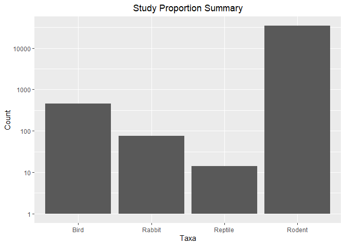

## Instructions
Answer the following questions and complete the exercises in RMarkdown. Please embed all of your code and push your final work to your repository. Your final lab report should be organized, clean, and run free from errors. Remember, you must remove the `#` for the included code chunks to run. Be sure to add your name to the author header above. For any included plots, make sure they are clearly labeled. You are free to use any plot type that you feel best communicates the results of your analysis.  

Make sure to use the formatting conventions of RMarkdown to make your report neat and clean!  

## Load the libraries

```r
library(tidyverse)
library(janitor)
library(here)
library(naniar)
```

## Desert Ecology
For this assignment, we are going to use a modified data set on [desert ecology](http://esapubs.org/archive/ecol/E090/118/). The data are from: S. K. Morgan Ernest, Thomas J. Valone, and James H. Brown. 2009. Long-term monitoring and experimental manipulation of a Chihuahuan Desert ecosystem near Portal, Arizona, USA. Ecology 90:1708.

```r
deserts <- read_csv(here("lab10", "data", "surveys_complete.csv"))
```

```
## 
## -- Column specification --------------------------------------------------------
## cols(
##   record_id = col_double(),
##   month = col_double(),
##   day = col_double(),
##   year = col_double(),
##   plot_id = col_double(),
##   species_id = col_character(),
##   sex = col_character(),
##   hindfoot_length = col_double(),
##   weight = col_double(),
##   genus = col_character(),
##   species = col_character(),
##   taxa = col_character(),
##   plot_type = col_character()
## )
```

1. Use the function(s) of your choice to get an idea of its structure, including how NA's are treated. Are the data tidy?  

```r
glimpse(deserts)
```

```
## Rows: 34,786
## Columns: 13
## $ record_id       <dbl> 1, 2, 3, 4, 5, 6, 7, 8, 9, 10, 11, 12, 13, 14, 15, 16,~
## $ month           <dbl> 7, 7, 7, 7, 7, 7, 7, 7, 7, 7, 7, 7, 7, 7, 7, 7, 7, 7, ~
## $ day             <dbl> 16, 16, 16, 16, 16, 16, 16, 16, 16, 16, 16, 16, 16, 16~
## $ year            <dbl> 1977, 1977, 1977, 1977, 1977, 1977, 1977, 1977, 1977, ~
## $ plot_id         <dbl> 2, 3, 2, 7, 3, 1, 2, 1, 1, 6, 5, 7, 3, 8, 6, 4, 3, 2, ~
## $ species_id      <chr> "NL", "NL", "DM", "DM", "DM", "PF", "PE", "DM", "DM", ~
## $ sex             <chr> "M", "M", "F", "M", "M", "M", "F", "M", "F", "F", "F",~
## $ hindfoot_length <dbl> 32, 33, 37, 36, 35, 14, NA, 37, 34, 20, 53, 38, 35, NA~
## $ weight          <dbl> NA, NA, NA, NA, NA, NA, NA, NA, NA, NA, NA, NA, NA, NA~
## $ genus           <chr> "Neotoma", "Neotoma", "Dipodomys", "Dipodomys", "Dipod~
## $ species         <chr> "albigula", "albigula", "merriami", "merriami", "merri~
## $ taxa            <chr> "Rodent", "Rodent", "Rodent", "Rodent", "Rodent", "Rod~
## $ plot_type       <chr> "Control", "Long-term Krat Exclosure", "Control", "Rod~
```
#### *NA* is used to indicate non availble data. Names of all columns are clean and neat. 

2. How many genera and species are represented in the data? What are the total number of observations? Which species is most/ least frequently sampled in the study?

```r
deserts%>%
  count(species, genus, sort=T)
```

```
## # A tibble: 48 x 3
##    species      genus               n
##    <chr>        <chr>           <int>
##  1 merriami     Dipodomys       10596
##  2 penicillatus Chaetodipus      3123
##  3 ordii        Dipodomys        3027
##  4 baileyi      Chaetodipus      2891
##  5 megalotis    Reithrodontomys  2609
##  6 spectabilis  Dipodomys        2504
##  7 torridus     Onychomys        2249
##  8 flavus       Perognathus      1597
##  9 eremicus     Peromyscus       1299
## 10 albigula     Neotoma          1252
## # ... with 38 more rows
```
#### Merriami of Dipodomys is most frequently sampled. Several species are sampled only once or twice. 

3. What is the proportion of taxa included in this study? Show a table and plot that reflects this count.

```r
deserts%>%
  count(taxa)
```

```
## # A tibble: 4 x 2
##   taxa        n
##   <chr>   <int>
## 1 Bird      450
## 2 Rabbit     75
## 3 Reptile    14
## 4 Rodent  34247
```

```r
deserts%>%
  ggplot(aes(x=taxa))+
  geom_bar()+
  scale_y_log10()+
  labs(title = "Study Proportion Summary", 
       x="Taxa", 
       y="Count")+
  theme(plot.title=element_text(hjust=.5))
```

<!-- -->

4. For the taxa included in the study, use the fill option to show the proportion of individuals sampled by `plot_type.`

```r
deserts%>%
  ggplot(aes(x=taxa, fill=plot_type))+
  geom_bar(position=position_fill())+
  labs(title = "Study Proportion Summary", 
       x="Taxa", 
       y="Ratio")+
  theme(plot.title=element_text(hjust=.5))
```

<!-- -->


5. What is the range of weight for each species included in the study? Remove any observations of weight that are NA so they do not show up in the plot.

```r
deserts%>%
  filter(!is.na(weight))%>%
  group_by(species)%>%
  summarise(max_weight=max(weight),min_weight=min(weight))
```

```
## # A tibble: 22 x 3
##    species     max_weight min_weight
##    <chr>            <dbl>      <dbl>
##  1 albigula           280         30
##  2 baileyi             55         12
##  3 eremicus            40          8
##  4 flavus              25          4
##  5 fulvescens          20          9
##  6 fulviventer        199         24
##  7 hispidus           140         16
##  8 intermedius         21         17
##  9 leucogaster         56         10
## 10 leucopus            27          8
## # ... with 12 more rows
```

```r
deserts%>%
  filter(!is.na(weight))%>%
  ggplot(aes(x=species, y=weight))+
  geom_boxplot()+
  theme(axis.text.x = element_text(angle = 60, hjust = 1))+
  labs(title = "Weight for Animals in Study", 
       x="Species", 
       y="Weight")+
  theme(plot.title=element_text(hjust=.5))
```

<!-- -->


6. Add another layer to your answer from #4 using `geom_point` to get an idea of how many measurements were taken for each species.

```r
deserts%>%
  filter(!is.na(weight))%>%
  count(species, taxa, plot_type)%>%
  ggplot(aes(x=species, y=n, color=plot_type))+
  geom_point()+
  scale_y_log10()+
  theme(axis.text.x = element_text(angle = 60, hjust = 1))+
  labs(title = "Measurements per Species", 
       x="Species", 
       y="Count")+
  theme(plot.title=element_text(hjust=.5))
```

<!-- -->


7. [Dipodomys merriami](https://en.wikipedia.org/wiki/Merriam's_kangaroo_rat) is the most frequently sampled animal in the study. How have the number of observations of this species changed over the years included in the study?

```r
deserts%>%
  filter(species=="merriami")%>%
  group_by(year)%>%
  summarise(n=n())%>%
  ggplot(aes(x=year, y=n))+
  geom_smooth(se=F)+
  labs(title = "Study Frequency over Time", 
       x="Year", 
       y="Count")+
  theme(plot.title=element_text(hjust=.5))
```

```
## `geom_smooth()` using method = 'loess' and formula 'y ~ x'
```

<!-- -->


8. What is the relationship between `weight` and `hindfoot` length? Consider whether or not over plotting is an issue.

```r
deserts%>%
  ggplot(aes(x=weight, y=hindfoot_length))+
  geom_point(alpha=.2)+
  geom_smooth(se=T)+
  labs(title = "Weight over Hindfoot Length", 
       x="Taxa", 
       y="Count")+
  theme(plot.title=element_text(hjust=.5))
```

```
## `geom_smooth()` using method = 'gam' and formula 'y ~ s(x, bs = "cs")'
```

```
## Warning: Removed 4048 rows containing non-finite values (stat_smooth).
```

```
## Warning: Removed 4048 rows containing missing values (geom_point).
```

<!-- -->
#### According to the plot, numerous data points have similar x and y value, so they tend to overlap each other and had to tell the individual values. 

9. Which two species have, on average, the highest weight? Once you have identified them, make a new column that is a ratio of `weight` to `hindfoot_length`. Make a plot that shows the range of this new ratio and fill by sex.

```r
deserts%>%
  group_by(species)%>%
  summarise(mean_weight=mean(weight, na.rm=T))%>%
  arrange(desc(mean_weight))
```

```
## # A tibble: 40 x 2
##    species      mean_weight
##    <chr>              <dbl>
##  1 albigula           159. 
##  2 spectabilis        120. 
##  3 spilosoma           93.5
##  4 hispidus            65.6
##  5 fulviventer         58.9
##  6 ochrognathus        55.4
##  7 ordii               48.9
##  8 merriami            43.2
##  9 baileyi             31.7
## 10 leucogaster         31.6
## # ... with 30 more rows
```
#### Albigula and Spectabilis have the highest weight. 

```r
deserts%>%
  filter(species=="albigula"|species=="spectabilis")%>%
  mutate(weight_foot_ratio=weight/hindfoot_length)%>%
  ggplot(aes(x=species, y=weight_foot_ratio, fill=sex))+
  geom_boxplot()+
  labs(title = "Weight over Hindfoot Length for Albigula and Spectabilis", 
       x="Species", 
       y="Count")+
  theme(plot.title=element_text(hjust=.5))
```

```
## Warning: Removed 684 rows containing non-finite values (stat_boxplot).
```

<!-- -->


10. Make one plot of your choice! Make sure to include at least two of the aesthetics options you have learned.

```r
deserts%>%
  filter(taxa=="Rodent")%>%
  filter(!is.na(weight))%>%
  filter(!is.na(hindfoot_length))%>%
  mutate(weight_foot_ratio=weight/hindfoot_length)%>%
  ggplot(aes(x=species, y=weight_foot_ratio))+
  geom_boxplot()+
  scale_y_log10()+
  theme(axis.text.x = element_text(angle = 60, hjust = 1))+
  labs(title = "Weight over Hindfoot Length for Rodent", 
       x="Species", 
       y="log10(Ratio)")+
  theme(plot.title=element_text(hjust=.5))
```

<!-- -->
#### According to this graph, I can conclude that Flavus has the smallest value of weight to hindfoot length. 

## Push your final code to GitHub!
Please be sure that you check the `keep md` file in the knit preferences. 
