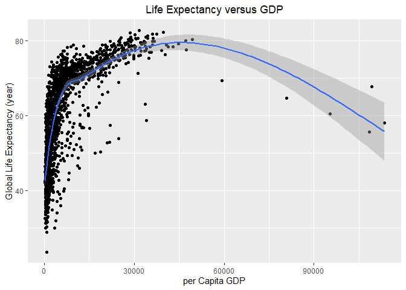

## Instructions
Answer the following questions and complete the exercises in RMarkdown. Please embed all of your code and push your final work to your repository. Your final lab report should be organized, clean, and run free from errors. Remember, you must remove the `#` for the included code chunks to run. Be sure to add your name to the author header above. For any included plots, make sure they are clearly labeled. You are free to use any plot type that you feel best communicates the results of your analysis.  

**In this homework, you should make use of the aesthetics you have learned. It's OK to be flashy!**

Make sure to use the formatting conventions of RMarkdown to make your report neat and clean!  

## Load the libraries

```r
library(tidyverse)
library(janitor)
library(here)
library(naniar)
library(skimr)
```

## Resources
The idea for this assignment came from [Rebecca Barter's](http://www.rebeccabarter.com/blog/2017-11-17-ggplot2_tutorial/) ggplot tutorial so if you get stuck this is a good place to have a look.  

## Gapminder
For this assignment, we are going to use the dataset [gapminder](https://cran.r-project.org/web/packages/gapminder/index.html). Gapminder includes information about economics, population, and life expectancy from countries all over the world. You will need to install it before use. This is the same data that we will use for midterm 2 so this is good practice.

```r
#install.packages("gapminder")
library("gapminder")
```

## Questions
The questions below are open-ended and have many possible solutions. Your approach should, where appropriate, include numerical summaries and visuals. Be creative; assume you are building an analysis that you would ultimately present to an audience of stakeholders. Feel free to try out different `geoms` if they more clearly present your results.  

**1. Use the function(s) of your choice to get an idea of the overall structure of the data frame, including its dimensions, column names, variable classes, etc. As part of this, determine how NA's are treated in the data.**  

```r
skim(gapminder)
```


Table: Data summary

                                     
-------------------------  ----------
Name                       gapminder 
Number of rows             1704      
Number of columns          6         
_______________________              
Column type frequency:               
factor                     2         
numeric                    4         
________________________             
Group variables            None      
-------------------------  ----------


**Variable type: factor**

skim_variable    n_missing   complete_rate  ordered    n_unique  top_counts                             
--------------  ----------  --------------  --------  ---------  ---------------------------------------
country                  0               1  FALSE           142  Afg: 12, Alb: 12, Alg: 12, Ang: 12     
continent                0               1  FALSE             5  Afr: 624, Asi: 396, Eur: 360, Ame: 300 


**Variable type: numeric**

skim_variable    n_missing   complete_rate          mean             sd         p0          p25          p50           p75           p100  hist  
--------------  ----------  --------------  ------------  -------------  ---------  -----------  -----------  ------------  -------------  ------
year                     0               1       1979.50          17.27    1952.00      1965.75      1979.50       1993.25         2007.0  ▇▅▅▅▇ 
lifeExp                  0               1         59.47          12.92      23.60        48.20        60.71         70.85           82.6  ▁▆▇▇▇ 
pop                      0               1   29601212.32   106157896.74   60011.00   2793664.00   7023595.50   19585221.75   1318683096.0  ▇▁▁▁▁ 
gdpPercap                0               1       7215.33        9857.45     241.17      1202.06      3531.85       9325.46       113523.1  ▇▁▁▁▁ 

```r
any_na(gapminder)
```

```
## [1] FALSE
```
#### This data is neat because no *NA* presented. 

**2. Among the interesting variables in gapminder is life expectancy. How has global life expectancy changed between 1952 and 2007?**

```r
gapminder$year<-as.factor(gapminder$year)
gapminder%>%
  group_by(year)%>%
  summarize(global_life_expectancy=mean(lifeExp))%>%
  ggplot(aes(x=year, y=global_life_expectancy, group = 1))+
  geom_line()+
  labs(title = "Global Life Expectancy over Years", 
       x="Year", 
       y="Global Life Expectancy (year)")+
  theme(plot.title=element_text(hjust=.5))
```

<!-- -->


**3. How do the distributions of life expectancy compare for the years 1952 and 2007?**

```r
gapminder%>%
  filter(year == "1952" | year == "2007")%>%
  ggplot(aes(x=lifeExp, fill=year))+
  geom_density(alpha=.5)+
  labs(title = "Global Life Expectancy for 1952 and 2007", 
       x="Global Life Expectancy (year)", 
       y="Proportion")+
  theme(plot.title=element_text(hjust=.5))
```

<!-- -->


**4. Your answer above doesn't tell the whole story since life expectancy varies by region. Make a summary that shows the min, mean, and max life expectancy by continent for all years represented in the data.**

```r
gapminder%>%
  group_by(continent, year)%>%
  summarise(annual_mean=mean(lifeExp), 
            annual_min=min(lifeExp), 
            annual_max=max(lifeExp))
```

```
## `summarise()` has grouped output by 'continent'. You can override using the `.groups` argument.
```

```
## # A tibble: 60 x 5
## # Groups:   continent [5]
##    continent year  annual_mean annual_min annual_max
##    <fct>     <fct>       <dbl>      <dbl>      <dbl>
##  1 Africa    1952         39.1       30         52.7
##  2 Africa    1957         41.3       31.6       58.1
##  3 Africa    1962         43.3       32.8       60.2
##  4 Africa    1967         45.3       34.1       61.6
##  5 Africa    1972         47.5       35.4       64.3
##  6 Africa    1977         49.6       36.8       67.1
##  7 Africa    1982         51.6       38.4       69.9
##  8 Africa    1987         53.3       39.9       71.9
##  9 Africa    1992         53.6       23.6       73.6
## 10 Africa    1997         53.6       36.1       74.8
## # ... with 50 more rows
```


**5. How has life expectancy changed between 1952-2007 for each continent?**

```r
gapminder%>%
  group_by(continent, year)%>%
  summarise(annual_mean=mean(lifeExp), 
            annual_min=min(lifeExp), 
            annual_max=max(lifeExp))%>%
  ggplot(aes(x=year, y=annual_mean, color=continent, group = continent))+
  geom_line(size=1.5)+
  labs(title = "Global Life Expectancy over Years", 
       x="Year", 
       y="Global Life Expectancy (year)")+
  theme(plot.title=element_text(hjust=.5))
```

```
## `summarise()` has grouped output by 'continent'. You can override using the `.groups` argument.
```

<!-- -->


**6. We are interested in the relationship between per capita GDP and life expectancy; i.e. does having more money help you live longer?**

```r
gapminder%>%
  ggplot(aes(y=lifeExp, x=gdpPercap))+
  geom_point()+
  geom_smooth(se=T)+
  labs(title = "Life Expectancy versus GDP", 
       x="per Capita GDP", 
       y="Global Life Expectancy (year)")+
  theme(plot.title=element_text(hjust=.5))
```

```
## `geom_smooth()` using method = 'gam' and formula 'y ~ s(x, bs = "cs")'
```

<!-- -->
#### When the country is really, higher GDP can lead to longer life expectancy. 

**7. Which countries have had the largest population growth since 1952?**

```r
gapminder%>%
  select(country, year, pop)%>%
  pivot_wider(names_from = year, 
              values_from = pop)%>%
  mutate(pop_growth=`2007`-`1952`)%>%
  select(country, pop_growth)%>%
  arrange(desc(pop_growth))
```

```
## # A tibble: 142 x 2
##    country       pop_growth
##    <fct>              <int>
##  1 China          762419569
##  2 India          738396331
##  3 United States  143586947
##  4 Indonesia      141495000
##  5 Brazil         133408087
##  6 Pakistan       127924057
##  7 Bangladesh     103561480
##  8 Nigeria        101912068
##  9 Mexico          78556574
## 10 Philippines     68638596
## # ... with 132 more rows
```
#### China experienced the greatest population growth since 1952. 

**8. Use your results from the question above to plot population growth for the top five countries since 1952.**

```r
gapminder%>%
  select(country, year, pop)%>%
  filter(country == "China" | country == "India" | country == "United States" | country == "Indonesia" | country == "Brazil")%>%
  ggplot(aes(x=year, y=pop, color=country, group=country))+ 
  geom_line(size=1.2)+
  labs(title = "Population Growth", 
       x="Year", 
       y="Population")+
  theme(plot.title=element_text(hjust=.5))
```

<!-- -->


**9. How does per-capita GDP growth compare between these same five countries?**

```r
gapminder%>%
  filter(country == "China" | country == "India" | country == "United States" | country == "Indonesia" | country == "Brazil")%>%
  select(country, year, gdpPercap)%>%
  ggplot(aes(x=year, y=gdpPercap, color=country, group=country))+ 
  geom_line(size=1.2)+
  scale_y_log10()+
  labs(title = "GDP Growth", 
       x="Year", 
       y="log10(per Capita GDP)")+
  theme(plot.title=element_text(hjust=.5))
```

<!-- -->


**10. Make one plot of your choice that uses faceting!**

```r
gapminder%>%
  select(continent, year, gdpPercap)%>%
  group_by(continent, year)%>%
  summarise(annual_continent_GDP=mean(gdpPercap))%>%
  ggplot(aes(x=year, y=annual_continent_GDP, group = 1))+
  geom_line()+
  facet_wrap(~continent)+
  labs(title = "GDP Growth", 
       x="Year", 
       y="per Capita GDP")+
  theme(plot.title=element_text(hjust=.5))+
  theme(axis.text.x = element_text(angle = 60, hjust = 1))
```

```
## `summarise()` has grouped output by 'continent'. You can override using the `.groups` argument.
```

<!-- -->


## Push your final code to GitHub!
Please be sure that you check the `keep md` file in the knit preferences. 
