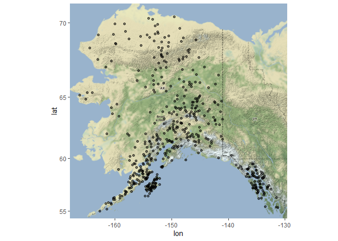
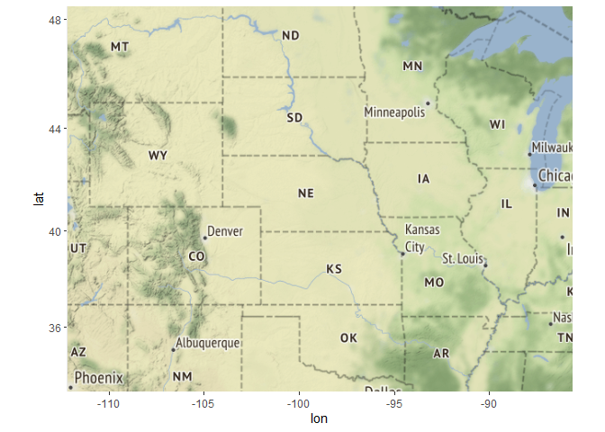
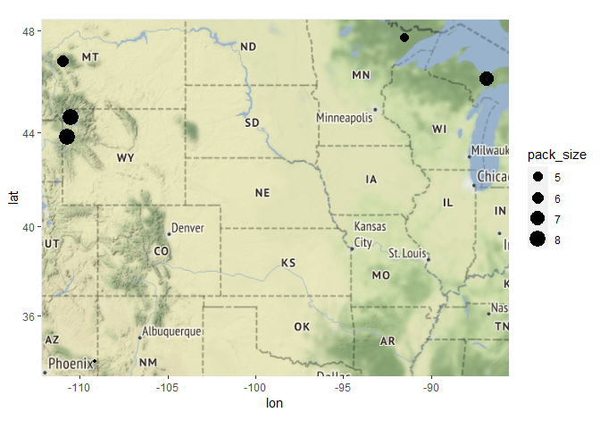

## Instructions
Answer the following questions and complete the exercises in RMarkdown. Please embed all of your code and push your final work to your repository. Your final lab report should be organized, clean, and run free from errors. Remember, you must remove the `#` for the included code chunks to run. Be sure to add your name to the author header above. For any included plots, make sure they are clearly labeled. You are free to use any plot type that you feel best communicates the results of your analysis.  

Make sure to use the formatting conventions of RMarkdown to make your report neat and clean!  

## Load the libraries

```r
library(tidyverse)
library(janitor)
library(here)
library(ggmap)
library(albersusa)
```

## Load the Data
We will use two separate data sets for this homework.  

1. The first [data set](https://rcweb.dartmouth.edu/~f002d69/workshops/index_rspatial.html) represent sightings of grizzly bears (Ursos arctos) in Alaska.  
2. The second data set is from Brandell, Ellen E (2021), Serological dataset and R code for: Patterns and processes of pathogen exposure in gray wolves across North America, Dryad, [Dataset](https://doi.org/10.5061/dryad.5hqbzkh51).  

1. Load the `grizzly` data and evaluate its structure. As part of this step, produce a summary that provides the range of latitude and longitude so you can build an appropriate bounding box.

```r
grizzly <- read.csv(here("lab12", "data", "bear-sightings.csv"))%>%
  clean_names()
```

```
## Warning in FUN(X[[i]], ...): strings not representable in native encoding will
## be translated to UTF-8
```

```
## Warning in FUN(X[[i]], ...): unable to translate '<U+00C4>' to native encoding
```

```
## Warning in FUN(X[[i]], ...): unable to translate '<U+00D6>' to native encoding
```

```
## Warning in FUN(X[[i]], ...): unable to translate '<U+00E4>' to native encoding
```

```
## Warning in FUN(X[[i]], ...): unable to translate '<U+00F6>' to native encoding
```

```
## Warning in FUN(X[[i]], ...): unable to translate '<U+00DF>' to native encoding
```

```
## Warning in FUN(X[[i]], ...): unable to translate '<U+00C6>' to native encoding
```

```
## Warning in FUN(X[[i]], ...): unable to translate '<U+00E6>' to native encoding
```

```
## Warning in FUN(X[[i]], ...): unable to translate '<U+00D8>' to native encoding
```

```
## Warning in FUN(X[[i]], ...): unable to translate '<U+00F8>' to native encoding
```

```
## Warning in FUN(X[[i]], ...): unable to translate '<U+00C5>' to native encoding
```

```
## Warning in FUN(X[[i]], ...): unable to translate '<U+00E5>' to native encoding
```


```r
grizzly%>%
  select(longitude, latitude)%>%
  summary()
```

```
##    longitude         latitude    
##  Min.   :-166.2   Min.   :55.02  
##  1st Qu.:-154.2   1st Qu.:58.13  
##  Median :-151.0   Median :60.97  
##  Mean   :-149.1   Mean   :61.41  
##  3rd Qu.:-145.6   3rd Qu.:64.13  
##  Max.   :-131.3   Max.   :70.37
```

2. Use the range of the latitude and longitude to build an appropriate bounding box for your map.

```r
lat <- c(55.02, 70.37 )
long <- c(-166.2, -131.3)
bounding <- make_bbox(long, lat, f = 0.05)
```

3. Load a map from `stamen` in a terrain style projection and display the map.

```r
grizzly_map <- get_map(bounding, style = "terrain", source = "stamen")
```

```
## Map tiles by Stamen Design, under CC BY 3.0. Data by OpenStreetMap, under ODbL.
```


```r
ggmap(grizzly_map)
```

<!-- -->

4. Build a final map that overlays the recorded observations of grizzly bears in Alaska.

```r
ggmap(grizzly_map)+
  geom_point(data = grizzly, aes(longitude, latitude), alpha=.5)
```

<!-- -->

5. Let's switch to the wolves data. Load the data and evaluate its structure.

```r
wolves <- read.csv(here("lab12", "data", "wolves_data", "wolves_dataset.csv"))%>%
  clean_names()
```

6. How many distinct wolf populations are included in this study? Make a new object that restricts the data to the wolf populations in the lower 48 US states.

```r
wolves%>%
  count(long, lat)%>%
  nrow()
```

```
## [1] 17
```


```r
wolves_48 <- wolves%>%
  filter(lat >= 25 & lat <=49)
summary(wolves_48$lat)
```

```
##    Min. 1st Qu.  Median    Mean 3rd Qu.    Max. 
##   33.89   44.60   44.60   43.95   46.83   47.75
```

```r
summary(wolves_48$long)
```

```
##    Min. 1st Qu.  Median    Mean 3rd Qu.    Max. 
## -110.99 -110.99 -110.55 -106.91 -109.17  -86.82
```

7. Use the `albersusa` package to make a base map of the lower 48 US states.

```r
lat <- c(33.89, 47.74)
long <- c(-110.99, -86.82)
bounding <- make_bbox(long, lat, f = 0.05)
```


```r
wolves_map <- get_map(bounding, style = "terrain", source = "stamen")
```

```
## Map tiles by Stamen Design, under CC BY 3.0. Data by OpenStreetMap, under ODbL.
```


```r
ggmap(wolves_map)
```

<!-- -->

8. Use the relimited data to plot the distribution of wolf populations in the lower 48 US states.

```r
ggmap(wolves_map)+
  geom_point(data = wolves_48, aes(long, lat), color = "tomato")
```

<!-- -->

9. What is the average pack size for the wolves in this study by region?

```r
wolves%>%
  mutate(region=case_when(lat >= 33.89 & lat <= 47.74~"lower 48 states", 
                   lat > 47.74~"Alaska", 
                   lat < 33.89~"Mexico"))%>%
  select(region, pack_size)%>%
  group_by(region)%>%
  unique()%>%
  summarise(average = mean(pack_size))
```

```
## # A tibble: 3 x 2
##   region          average
##   <chr>             <dbl>
## 1 Alaska             6.18
## 2 lower 48 states    7.27
## 3 Mexico             4.04
```

10. Make a new map that shows the distribution of wolves in the lower 48 US states but which has the size of location markers adjusted by pack size.

```r
ggmap(wolves_map)+
  geom_point(data = wolves_48, aes(long, lat, size = pack_size))
```

<!-- -->

## Push your final code to GitHub!
Please be sure that you check the `keep md` file in the knit preferences. 
