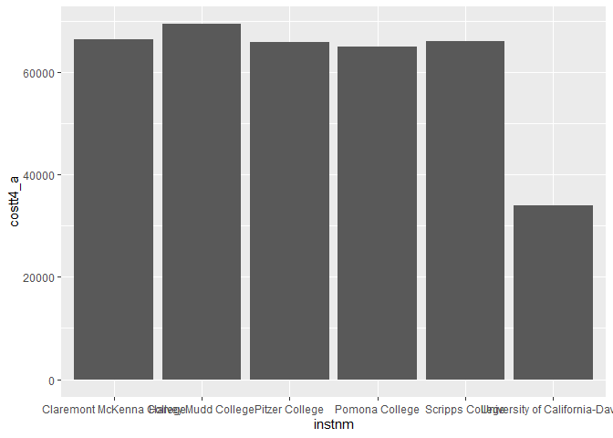
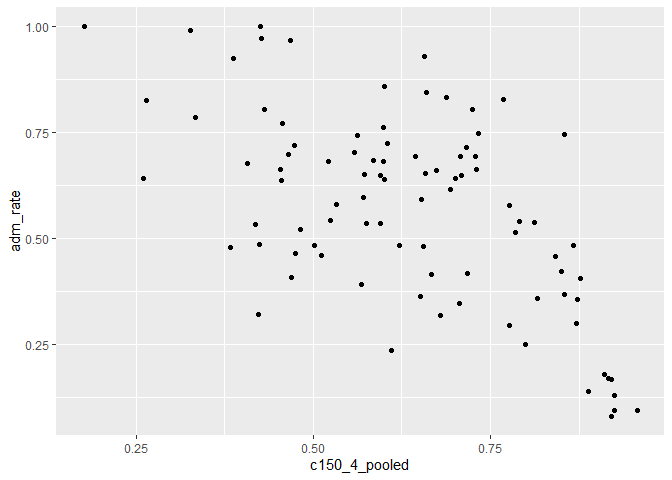
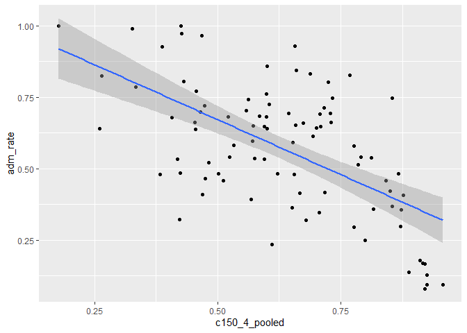

## Instructions
Answer the following questions and complete the exercises in RMarkdown. Please embed all of your code and push your final work to your repository. Your final lab report should be organized, clean, and run free from errors. Remember, you must remove the `#` for the included code chunks to run. Be sure to add your name to the author header above.  

Make sure to use the formatting conventions of RMarkdown to make your report neat and clean!  

## Load the libraries

```r
library(tidyverse)
library(janitor)
library(here)
library(naniar)
library(skimr)
```

For this homework, we will take a departure from biological data and use data about California colleges. These data are a subset of the national college scorecard (https://collegescorecard.ed.gov/data/). Load the `ca_college_data.csv` as a new object called `colleges`.

```r
colleges <- readr::read_csv("data/ca_college_data.csv")
```

```
## 
## -- Column specification --------------------------------------------------------
## cols(
##   INSTNM = col_character(),
##   CITY = col_character(),
##   STABBR = col_character(),
##   ZIP = col_character(),
##   ADM_RATE = col_double(),
##   SAT_AVG = col_double(),
##   PCIP26 = col_double(),
##   COSTT4_A = col_double(),
##   C150_4_POOLED = col_double(),
##   PFTFTUG1_EF = col_double()
## )
```

The variables are a bit hard to decipher, here is a key:  

INSTNM: Institution name  
CITY: California city  
STABBR: Location state  
ZIP: Zip code  
ADM_RATE: Admission rate  
SAT_AVG: SAT average score  
PCIP26: Percentage of degrees awarded in Biological And Biomedical Sciences  
COSTT4_A: Annual cost of attendance  
C150_4_POOLED: 4-year completion rate  
PFTFTUG1_EF: Percentage of undergraduate students who are first-time, full-time degree/certificate-seeking undergraduate students  

1. Use your preferred function(s) to have a look at the data and get an idea of its structure. Make sure you summarize NA's and determine whether or not the data are tidy. You may also consider dealing with any naming issues.

```r
head(colleges, n=5)
```

```
## # A tibble: 5 x 10
##   INSTNM       CITY  STABBR ZIP   ADM_RATE SAT_AVG PCIP26 COSTT4_A C150_4_POOLED
##   <chr>        <chr> <chr>  <chr>    <dbl>   <dbl>  <dbl>    <dbl>         <dbl>
## 1 Grossmont C~ El C~ CA     9202~       NA      NA 0.0016     7956            NA
## 2 College of ~ Visa~ CA     9327~       NA      NA 0.0066     8109            NA
## 3 College of ~ San ~ CA     9440~       NA      NA 0.0038     8278            NA
## 4 Ventura Col~ Vent~ CA     9300~       NA      NA 0.0035     8407            NA
## 5 Oxnard Coll~ Oxna~ CA     9303~       NA      NA 0.0085     8516            NA
## # ... with 1 more variable: PFTFTUG1_EF <dbl>
```


```r
skim(colleges)
```


Table: Data summary

                                    
-------------------------  ---------
Name                       colleges 
Number of rows             341      
Number of columns          10       
_______________________             
Column type frequency:              
character                  4        
numeric                    6        
________________________            
Group variables            None     
-------------------------  ---------


**Variable type: character**

skim_variable    n_missing   complete_rate   min   max   empty   n_unique   whitespace
--------------  ----------  --------------  ----  ----  ------  ---------  -----------
INSTNM                   0               1    10    63       0        341            0
CITY                     0               1     4    19       0        161            0
STABBR                   0               1     2     2       0          3            0
ZIP                      0               1     5    10       0        324            0


**Variable type: numeric**

skim_variable    n_missing   complete_rate       mean         sd        p0        p25        p50        p75       p100  hist  
--------------  ----------  --------------  ---------  ---------  --------  ---------  ---------  ---------  ---------  ------
ADM_RATE               240            0.30       0.59       0.23      0.08       0.46       0.64       0.75       1.00  ▂▃▆▇▃ 
SAT_AVG                276            0.19    1112.31     170.80    870.00     985.00    1078.00    1237.00    1555.00  ▇▇▅▂▂ 
PCIP26                  35            0.90       0.02       0.04      0.00       0.00       0.00       0.02       0.22  ▇▁▁▁▁ 
COSTT4_A               124            0.64   26685.17   18122.70   7956.00   12578.00   16591.00   39289.00   69355.00  ▇▂▂▁▂ 
C150_4_POOLED          221            0.35       0.57       0.21      0.06       0.43       0.58       0.72       0.96  ▂▃▇▇▅ 
PFTFTUG1_EF             53            0.84       0.56       0.29      0.01       0.32       0.50       0.81       1.00  ▃▇▆▅▇ 


```r
colleges <- janitor::clean_names(colleges)
```

```
## Warning in FUN(X[[i]], ...): strings not representable in native encoding will
## be translated to UTF-8
```

```r
head(colleges, n=5)
```

```
## # A tibble: 5 x 10
##   instnm       city  stabbr zip   adm_rate sat_avg pcip26 costt4_a c150_4_pooled
##   <chr>        <chr> <chr>  <chr>    <dbl>   <dbl>  <dbl>    <dbl>         <dbl>
## 1 Grossmont C~ El C~ CA     9202~       NA      NA 0.0016     7956            NA
## 2 College of ~ Visa~ CA     9327~       NA      NA 0.0066     8109            NA
## 3 College of ~ San ~ CA     9440~       NA      NA 0.0038     8278            NA
## 4 Ventura Col~ Vent~ CA     9300~       NA      NA 0.0035     8407            NA
## 5 Oxnard Coll~ Oxna~ CA     9303~       NA      NA 0.0085     8516            NA
## # ... with 1 more variable: pftftug1_ef <dbl>
```

2. Which cities in California have the highest number of colleges?

```r
colleges%>%
  filter(stabbr == "CA")%>%
  count(city, sort=T)
```

```
## # A tibble: 159 x 2
##    city              n
##    <chr>         <int>
##  1 Los Angeles      24
##  2 San Diego        18
##  3 San Francisco    15
##  4 Sacramento       10
##  5 Berkeley          9
##  6 Oakland           9
##  7 Claremont         7
##  8 Pasadena          6
##  9 Fresno            5
## 10 Irvine            5
## # ... with 149 more rows
```
#### Los Angeles has the highest number of colleges. 

3. Based on your answer to #2, make a plot that shows the number of colleges in the top 10 cities.

```r
colleges%>%
  filter(stabbr == "CA")%>%
  count(city, sort=T)%>%
  head(n=10)%>%
  ggplot(mapping=aes(x=city, y=n))+geom_col()
```

<!-- -->

4. The column `COSTT4_A` is the annual cost of each institution. Which city has the highest average cost? Where is it located?

```r
colleges%>%
  group_by(city)%>%
  summarise(mean_annual_cost = mean(costt4_a, na.rm = T))%>%
  arrange(desc(mean_annual_cost))
```

```
## # A tibble: 161 x 2
##    city                mean_annual_cost
##    <chr>                          <dbl>
##  1 Claremont                      66498
##  2 Malibu                         66152
##  3 Valencia                       64686
##  4 Orange                         64501
##  5 Redlands                       61542
##  6 Moraga                         61095
##  7 Atherton                       56035
##  8 Thousand Oaks                  54373
##  9 Rancho Palos Verdes            50758
## 10 La Verne                       50603
## # ... with 151 more rows
```
#### It shows that colleges in Claremont have the highest average annual cost. This city is in California. 

5. Based on your answer to #4, make a plot that compares the cost of the individual colleges in the most expensive city. Bonus! Add UC Davis here to see how it compares :>).

```r
colleges%>%
  filter(city == "Claremont" | instnm == "University of California-Davis")%>%
  filter(!is.na(costt4_a))%>%
  ggplot(mapping = aes(x=instnm, y=costt4_a))+geom_col()
```

<!-- -->
 

6. The column `ADM_RATE` is the admissions rate by college and `C150_4_POOLED` is the four-year completion rate. Use a scatterplot to show the relationship between these two variables. What do you think this means?

```r
colleges%>%
  filter(!is.na(c150_4_pooled)&!is.na(adm_rate))%>%
  ggplot(mapping = aes(x=c150_4_pooled, y=adm_rate)) + geom_point()
```

<!-- -->

7. Is there a relationship between cost and four-year completion rate? (You don't need to do the stats, just produce a plot). What do you think this means?

```r
colleges%>%
  filter(!is.na(c150_4_pooled)&!is.na(adm_rate))%>%
  ggplot(mapping = aes(x=c150_4_pooled, y=adm_rate)) + 
  geom_point()+
  geom_smooth(method = lm, se=T)
```

```
## `geom_smooth()` using formula 'y ~ x'
```

<!-- -->
#### It means the school with higher admission rate will have lwer completion rate. 

8. The column titled `INSTNM` is the institution name. We are only interested in the University of California colleges. Make a new data frame that is restricted to UC institutions. You can remove `Hastings College of Law` and `UC San Francisco` as we are only interested in undergraduate institutions.

```r
UC <- colleges%>%
  filter(stabbr == "CA")%>%
  filter(grepl("University of California", instnm))
UC
```

```
## # A tibble: 10 x 10
##    instnm      city  stabbr zip   adm_rate sat_avg pcip26 costt4_a c150_4_pooled
##    <chr>       <chr> <chr>  <chr>    <dbl>   <dbl>  <dbl>    <dbl>         <dbl>
##  1 University~ La J~ CA     92093    0.357    1324  0.216    31043         0.872
##  2 University~ Irvi~ CA     92697    0.406    1206  0.107    31198         0.876
##  3 University~ Rive~ CA     92521    0.663    1078  0.149    31494         0.73 
##  4 University~ Los ~ CA     9009~    0.180    1334  0.155    33078         0.911
##  5 University~ Davis CA     9561~    0.423    1218  0.198    33904         0.850
##  6 University~ Sant~ CA     9506~    0.578    1201  0.193    34608         0.776
##  7 University~ Berk~ CA     94720    0.169    1422  0.105    34924         0.916
##  8 University~ Sant~ CA     93106    0.358    1281  0.108    34998         0.816
##  9 University~ San ~ CA     9410~   NA          NA NA           NA        NA    
## 10 University~ San ~ CA     9414~   NA          NA NA           NA        NA    
## # ... with 1 more variable: pftftug1_ef <dbl>
```

Remove `Hastings College of Law` and `UC San Francisco` and store the final data frame as a new object `univ_calif_final`.

```r
univ_calif_final <- UC%>%
  filter(instnm != "University of California-Hastings College of Law" & instnm != "University of California-San Francisco")
univ_calif_final
```

```
## # A tibble: 8 x 10
##   instnm       city  stabbr zip   adm_rate sat_avg pcip26 costt4_a c150_4_pooled
##   <chr>        <chr> <chr>  <chr>    <dbl>   <dbl>  <dbl>    <dbl>         <dbl>
## 1 University ~ La J~ CA     92093    0.357    1324  0.216    31043         0.872
## 2 University ~ Irvi~ CA     92697    0.406    1206  0.107    31198         0.876
## 3 University ~ Rive~ CA     92521    0.663    1078  0.149    31494         0.73 
## 4 University ~ Los ~ CA     9009~    0.180    1334  0.155    33078         0.911
## 5 University ~ Davis CA     9561~    0.423    1218  0.198    33904         0.850
## 6 University ~ Sant~ CA     9506~    0.578    1201  0.193    34608         0.776
## 7 University ~ Berk~ CA     94720    0.169    1422  0.105    34924         0.916
## 8 University ~ Sant~ CA     93106    0.358    1281  0.108    34998         0.816
## # ... with 1 more variable: pftftug1_ef <dbl>
```

Use `separate()` to separate institution name into two new columns "UNIV" and "CAMPUS".

```r
univ_calif_final%>%
  separate(instnm, into = c("univ", "campus"), sep="-")
```

```
## # A tibble: 8 x 11
##   univ  campus city  stabbr zip   adm_rate sat_avg pcip26 costt4_a c150_4_pooled
##   <chr> <chr>  <chr> <chr>  <chr>    <dbl>   <dbl>  <dbl>    <dbl>         <dbl>
## 1 Univ~ San D~ La J~ CA     92093    0.357    1324  0.216    31043         0.872
## 2 Univ~ Irvine Irvi~ CA     92697    0.406    1206  0.107    31198         0.876
## 3 Univ~ River~ Rive~ CA     92521    0.663    1078  0.149    31494         0.73 
## 4 Univ~ Los A~ Los ~ CA     9009~    0.180    1334  0.155    33078         0.911
## 5 Univ~ Davis  Davis CA     9561~    0.423    1218  0.198    33904         0.850
## 6 Univ~ Santa~ Sant~ CA     9506~    0.578    1201  0.193    34608         0.776
## 7 Univ~ Berke~ Berk~ CA     94720    0.169    1422  0.105    34924         0.916
## 8 Univ~ Santa~ Sant~ CA     93106    0.358    1281  0.108    34998         0.816
## # ... with 1 more variable: pftftug1_ef <dbl>
```

9. The column `ADM_RATE` is the admissions rate by campus. Which UC has the lowest and highest admissions rates? Produce a numerical summary and an appropriate plot.

```r
univ_calif_final%>%
  arrange(desc(adm_rate))
```

```
## # A tibble: 8 x 10
##   instnm       city  stabbr zip   adm_rate sat_avg pcip26 costt4_a c150_4_pooled
##   <chr>        <chr> <chr>  <chr>    <dbl>   <dbl>  <dbl>    <dbl>         <dbl>
## 1 University ~ Rive~ CA     92521    0.663    1078  0.149    31494         0.73 
## 2 University ~ Sant~ CA     9506~    0.578    1201  0.193    34608         0.776
## 3 University ~ Davis CA     9561~    0.423    1218  0.198    33904         0.850
## 4 University ~ Irvi~ CA     92697    0.406    1206  0.107    31198         0.876
## 5 University ~ Sant~ CA     93106    0.358    1281  0.108    34998         0.816
## 6 University ~ La J~ CA     92093    0.357    1324  0.216    31043         0.872
## 7 University ~ Los ~ CA     9009~    0.180    1334  0.155    33078         0.911
## 8 University ~ Berk~ CA     94720    0.169    1422  0.105    34924         0.916
## # ... with 1 more variable: pftftug1_ef <dbl>
```


```r
univ_calif_final%>%
  separate(instnm, into = c("univ", "campus"), sep="-")%>%
  arrange(desc(adm_rate))%>%
  ggplot(mapping = aes(x=campus, y=adm_rate))+geom_col()
```

<!-- -->
#### Berkeley has the lowest and Riverside has the highest. 

10. If you wanted to get a degree in biological or biomedical sciences, which campus confers the majority of these degrees? Produce a numerical summary and an appropriate plot.

```r
colleges%>%
  filter(!is.na(pcip26))%>%
  arrange(desc(pcip26))%>%
  head(n=5)
```

```
## # A tibble: 5 x 10
##   instnm       city  stabbr zip   adm_rate sat_avg pcip26 costt4_a c150_4_pooled
##   <chr>        <chr> <chr>  <chr>    <dbl>   <dbl>  <dbl>    <dbl>         <dbl>
## 1 University ~ La J~ CA     92093   0.357     1324  0.216    31043         0.872
## 2 University ~ Davis CA     9561~   0.423     1218  0.198    33904         0.850
## 3 University ~ Sant~ CA     9506~   0.578     1201  0.193    34608         0.776
## 4 Pomona Coll~ Clar~ CA     9171~   0.0944    1442  0.171    64870         0.957
## 5 University ~ Los ~ CA     9009~   0.180     1334  0.155    33078         0.911
## # ... with 1 more variable: pftftug1_ef <dbl>
```


```r
colleges%>%
  filter(!is.na(pcip26))%>%
  arrange(desc(pcip26))%>%
  head(n=5)%>%
  ggplot(mapping=aes(x=instnm, y=pcip26))+geom_col()
```

<!-- -->
#### UC San Diego gives the highest ratio of degrees in biological and biomedical sciences. 

## Knit Your Output and Post to [GitHub](https://github.com/FRS417-DataScienceBiologists)
