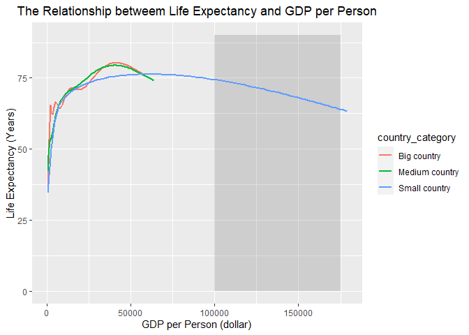

## Instructions
Answer the following questions and complete the exercises in RMarkdown. Please embed all of your code and push your final work to your repository. Your code should be organized, clean, and run free from errors. Be sure to **add your name** to the author header above. You may use any resources to answer these questions (including each other), but you may not post questions to Open Stacks or external help sites. There are 10 total questions.  

Make sure to use the formatting conventions of RMarkdown to make your report neat and clean! Your plots should use consistent aesthetics throughout.  

This exam is due by **12:00p on Tuesday, February 22**.  

## Gapminder
For this assignment, we are going to use data from  [gapminder](https://www.gapminder.org/). Gapminder includes information about economics, population, social issues, and life expectancy from countries all over the world. We will use three data sets, so please load all three as separate objects.    

```r
library(tidyverse)
```

```
## -- Attaching packages --------------------------------------- tidyverse 1.3.1 --
```

```
## v ggplot2 3.3.5     v purrr   0.3.4
## v tibble  3.1.1     v dplyr   1.0.6
## v tidyr   1.1.3     v stringr 1.4.0
## v readr   1.4.0     v forcats 0.5.1
```

```
## -- Conflicts ------------------------------------------ tidyverse_conflicts() --
## x dplyr::filter() masks stats::filter()
## x dplyr::lag()    masks stats::lag()
```

```r
library(here)
```

```
## here() starts at C:/Users/user/Desktop/BIS15W2022_hqian
```

```r
library(skimr)
library(janitor)
```

```
## 
## Attaching package: 'janitor'
```

```
## The following objects are masked from 'package:stats':
## 
##     chisq.test, fisher.test
```

```r
library(ggplot2)
```

1. population_total.csv  
2. income_per_person_gdppercapita_ppp_inflation_adjusted.csv  
3. life_expectancy_years.csv  

```r
population <-  read_csv(here("midterm2", "data", "population_total.csv")) 
```

```
## 
## -- Column specification --------------------------------------------------------
## cols(
##   .default = col_double(),
##   country = col_character()
## )
## i<U+00A0>Use `spec()` for the full column specifications.
```

```r
income <- read_csv(here("midterm2", "data", "income_per_person_gdppercapita_ppp_inflation_adjusted.csv")) 
```

```
## 
## -- Column specification --------------------------------------------------------
## cols(
##   .default = col_double(),
##   country = col_character()
## )
## i<U+00A0>Use `spec()` for the full column specifications.
```

```r
life <- read_csv(here("midterm2", "data", "life_expectancy_years.csv"))
```

```
## 
## -- Column specification --------------------------------------------------------
## cols(
##   .default = col_double(),
##   country = col_character()
## )
## i<U+00A0>Use `spec()` for the full column specifications.
```

1. (3 points) Once you have an idea of the structure of the data, please make each data set tidy (hint: think back to pivots) and store them as new objects. You will need both the original (wide) and tidy (long) data!  

```r
population <- population %>%
  pivot_longer(cols = c(!contains("country")),
                           names_to = "year",
                           values_to = "population")
population$year <- as.numeric(population$year)
```

```r
income <- income %>%
  pivot_longer(cols = c(!contains("country")),
                           names_to = "year",
                           values_to = "gdp_per_capita")
income$year <- as.numeric(income$year)
```

```r
life <- life %>%
  pivot_longer(cols = c(!contains("country")),
                           names_to = "year",
                           values_to = "expectancy")
life$year <- as.numeric(life$year)
```


2. (1 point) How many different countries are represented in the data? Provide the total number and their names. Since each data set includes different numbers of countries, you will need to do this for each one.  

```r
population%>%
  summarize(n_country = n_distinct(country))
```

```
## # A tibble: 1 x 1
##   n_country
##       <int>
## 1       195
```

```r
population%>%
  count(country)%>%
  select(country)
```

```
## # A tibble: 195 x 1
##    country            
##    <chr>              
##  1 Afghanistan        
##  2 Albania            
##  3 Algeria            
##  4 Andorra            
##  5 Angola             
##  6 Antigua and Barbuda
##  7 Argentina          
##  8 Armenia            
##  9 Australia          
## 10 Austria            
## # ... with 185 more rows
```

```r
income%>%
  summarize(n_country = n_distinct(country))
```

```
## # A tibble: 1 x 1
##   n_country
##       <int>
## 1       193
```

```r
income%>%
  count(country)%>%
  select(country)
```

```
## # A tibble: 193 x 1
##    country            
##    <chr>              
##  1 Afghanistan        
##  2 Albania            
##  3 Algeria            
##  4 Andorra            
##  5 Angola             
##  6 Antigua and Barbuda
##  7 Argentina          
##  8 Armenia            
##  9 Australia          
## 10 Austria            
## # ... with 183 more rows
```

```r
life%>%
  summarize(n_country = n_distinct(country))
```

```
## # A tibble: 1 x 1
##   n_country
##       <int>
## 1       187
```

```r
life%>%
  count(country)%>%
  select(country)
```

```
## # A tibble: 187 x 1
##    country            
##    <chr>              
##  1 Afghanistan        
##  2 Albania            
##  3 Algeria            
##  4 Andorra            
##  5 Angola             
##  6 Antigua and Barbuda
##  7 Argentina          
##  8 Armenia            
##  9 Australia          
## 10 Austria            
## # ... with 177 more rows
```

## Life Expectancy  

3. (2 points) Let's limit the data to 100 years (1920-2020). For these years, which country has the highest average life expectancy? How about the lowest average life expectancy?  

```r
life%>%
  filter(year >= 1920 & year <= 2020)%>%
  group_by(country)%>%
  summarise(average = mean(expectancy, na.rm=T))%>%
  arrange(average)
```

```
## # A tibble: 187 x 2
##    country                  average
##    <chr>                      <dbl>
##  1 Central African Republic    41.8
##  2 Mali                        41.8
##  3 Ethiopia                    42.6
##  4 Sierra Leone                42.6
##  5 Guinea-Bissau               42.6
##  6 Burundi                     42.8
##  7 Malawi                      42.8
##  8 Uganda                      43.3
##  9 Eritrea                     43.4
## 10 Yemen                       43.6
## # ... with 177 more rows
```

#### Lowest value belongs to Central African Republic. Highest value belongs to Andorra

4. (3 points) Although we can see which country has the highest life expectancy for the past 100 years, we don't know which countries have changed the most. What are the top 5 countries that have experienced the biggest improvement in life expectancy between 1920-2020?  

```r
life%>%
  filter(year == 1920 | year == 2020)%>%
  filter(!is.na(expectancy))%>%
  pivot_wider(names_from = year, 
              values_from = expectancy)%>%
  group_by(country)%>%
  mutate(improvement = `2020` -`1920`)%>%
  arrange(desc(improvement))%>%
  head(n=5)
```

```
## # A tibble: 5 x 4
## # Groups:   country [5]
##   country         `1920` `2020` improvement
##   <chr>            <dbl>  <dbl>       <dbl>
## 1 Kuwait            26.6   83.4        56.8
## 2 Kyrgyz Republic   16.6   73.1        56.5
## 3 Turkmenistan      15.2   70.5        55.3
## 4 South Korea       28.2   83.2        55  
## 5 Tajikistan        16.7   71          54.3
```

#### Kuwait, Kyrgyz Republic, Turkmenistan, South Korea, and Tajikistan exprerienced the greatest improvement in life expectancy. 

5. (3 points) Make a plot that shows the change over the past 100 years for the country with the biggest improvement in life expectancy. Be sure to add appropriate aesthetics to make the plot clean and clear. Once you have made the plot, do a little internet searching and see if you can discover what historical event may have contributed to this remarkable change.  

```r
life%>%
  filter(country == "Kuwait" | country == "Kyrgyz Republic" | country == "Turkmenistan" | country == "South Korea" | country == "Tajikistan")%>%
  filter(year >= 1920 & year <= 2020)%>%
  ggplot(aes(x=year, y=expectancy, color = country))+ 
  geom_line(alpha=.5, size=1.5)+
  labs(title = "Life Expectancy over Time", 
       x="Year", 
       y="Life Expectancy(years)")+
  theme(plot.title=element_text(hjust=.5))
```

<!-- -->


## Population Growth
6. (3 points) Which 5 countries have had the highest population growth over the past 100 years (1920-2020)?  

```r
population%>%
  filter(year == 1920 | year == 2020)%>%
  filter(!is.na(population))%>%
  pivot_wider(names_from = year, 
              values_from = population)%>%
  mutate(growth = `2020` -`1920`)%>%
  arrange(desc(growth))%>%
  head(n=5)
```

```
## # A tibble: 5 x 4
##   country          `1920`     `2020`     growth
##   <chr>             <dbl>      <dbl>      <dbl>
## 1 India         317000000 1380000000 1063000000
## 2 China         472000000 1440000000  968000000
## 3 Indonesia      47300000  274000000  226700000
## 4 United States 111000000  331000000  220000000
## 5 Pakistan       21700000  221000000  199300000
```

#### India, China, Indonesia, United States, and Pakistan experienced the greatest population growth. 

7. (4 points) Produce a plot that shows the 5 countries that have had the highest population growth over the past 100 years (1920-2020). Which countries appear to have had exponential growth?  

```r
population%>%
  filter(country == "China" | country == "Indonesia" | country == "India" | country == "United States" | country == "Pakistan")%>%
  filter(year >= 1920 & year <= 2020)%>%
  ggplot(aes(x=year, y=population, color = country))+ 
  geom_line(alpha=.5, size=1.5)+
  scale_y_log10()+
  labs(title = "Population change over Time", 
       x="Year", 
       y="log10(Population)")+
  theme(plot.title=element_text(hjust=.5))
```

<!-- -->


## Income
The units used for income are gross domestic product per person adjusted for differences in purchasing power in international dollars.

8. (4 points) As in the previous questions, which countries have experienced the biggest growth in per person GDP. Show this as a table and then plot the changes for the top 5 countries. With a bit of research, you should be able to explain the dramatic downturns of the wealthiest economies that occurred during the 1980's.

```r
income%>%
  filter(year == 1920 | year == 2020)%>%
  filter(!is.na(gdp_per_capita))%>%
  pivot_wider(names_from = year, 
              values_from = gdp_per_capita)%>%
  mutate(growth = `2020` -`1920`)%>%
  arrange(desc(growth))%>%
  head(n=5)
```

```
## # A tibble: 5 x 4
##   country    `1920` `2020` growth
##   <chr>       <dbl>  <dbl>  <dbl>
## 1 Qatar        2300 116000 113700
## 2 Luxembourg   5730  95100  89370
## 3 Singapore    2440  90500  88060
## 4 Brunei       2130  75100  72970
## 5 Ireland      5170  74100  68930
```

```r
income%>%
  filter(country == "Qatar" | country == "Luxembourg" | country == "Singapore" | country == "Brunei" | country == "Ireland")%>%
  filter(year >= 1920 & year <= 2020)%>%
  ggplot(aes(x=year, y=gdp_per_capita, color = country))+ 
  geom_line(alpha=.5, size=1.5)+
  scale_y_log10()+
  labs(title = "GDP per Person Change over Time", 
       x="Year", 
       y="log10(Population)")+
  theme(plot.title=element_text(hjust=.5))
```

<!-- -->

#### To make my life easier, I just calculate the difference between the value from 1920 and 2020. The drop around 1980's should correspond with the Soviet destruction. 

9. (3 points) Create three new objects that restrict each data set (life expectancy, population, income) to the years 1920-2020. Hint: I suggest doing this with the long form of your data. Once this is done, merge all three data sets using the code I provide below. You may need to adjust the code depending on how you have named your objects. I called mine `life_expectancy_100`, `population_100`, and `income_100`. For some of you, learning these `joins` will be important for your project.  


```r
life_expectancy_100 <- life%>%
  filter(year >= 1920 & year <= 2020)
population_100 <- population %>%
  filter(year >= 1920 & year <= 2020)
income_100 <- income %>%
  filter(year >= 1920 & year <= 2020)
gapminder_join <- inner_join(life_expectancy_100, population_100, by= c("country", "year"))
gapminder_join <- inner_join(gapminder_join, income_100, by= c("country", "year"))
gapminder_join
```

```
## # A tibble: 18,887 x 5
##    country      year expectancy population gdp_per_capita
##    <chr>       <dbl>      <dbl>      <dbl>          <dbl>
##  1 Afghanistan  1920       30.6   10600000           1490
##  2 Afghanistan  1921       30.7   10500000           1520
##  3 Afghanistan  1922       30.8   10300000           1550
##  4 Afghanistan  1923       30.8    9710000           1570
##  5 Afghanistan  1924       30.9    9200000           1600
##  6 Afghanistan  1925       31      8720000           1630
##  7 Afghanistan  1926       31      8260000           1650
##  8 Afghanistan  1927       31.1    7830000           1680
##  9 Afghanistan  1928       31.1    7420000           1710
## 10 Afghanistan  1929       31.2    7100000           1740
## # ... with 18,877 more rows
```

10. (4 points) Use the joined data to perform an analysis of your choice. The analysis should include a comparison between two or more of the variables `life_expectancy`, `population`, or `income.`  

```r
gapminder_join%>%
  mutate(country_category=case_when(population < 10000000 ~ "Small country", 
                                  population >= 10000000 & population <= 100000000 ~ "Medium country",
                                  population >= 100000000 ~ "Big country"))%>%
  ggplot(aes(x=gdp_per_capita, y=expectancy, color=country_category))+
  annotate("rect", xmin=100000, xmax=160000, ymin=0, ymax=90, alpha=0.2)+
  geom_smooth(alpha=.8, se=F)+
  labs(title = "The Relationship betweem Life Expectancy and GDP per Person", 
       x="GDP per Person (dollar)", 
       y="Life Expectancy (Years)")+
  theme(plot.title=element_text(hjust=.5))
```

```
## `geom_smooth()` using method = 'gam' and formula 'y ~ s(x, bs = "cs")'
```

```
## Warning: Removed 159 rows containing non-finite values (stat_smooth).
```

<!-- -->

#### Grey rectangle annotates the range of "developed country" accorig to GDP. 

#### I just classify country in each year as big, small, or medium according to their population size. Then, the consequence means that GDP can improve life expectancy when GDP is low, but GDP will have an opposite effect on life expectancy when GDP is extremely large. 
